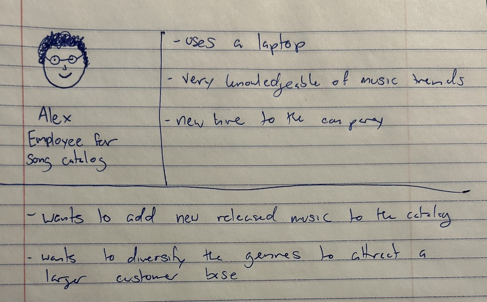

# Project 3, Milestone 1: **Administrator** Design Journey

[← Table of Contents](../design-journey.md)

## _Cohesive_ Audience
> Briefly explain your site's **administrator** audience.
> Your audience should be specific, but not arbitrarily specific.

The admin audience is made up of employees that keep the song catalog up to date and maintain the website and information.

> Be specific and justify why this audience is a **cohesive** group. (1-2 sentences)

They are all employees at the same company and are tasked with keeping the catalog up to date to ensure the best user experience for their consumer base.

## Audience Goals
> Document your **administrator** audience's goals.
> List each goal below. There is no specific number of goals required for this, but you need
> enough to do the job (Hint: It's at least 1, but probably no more than 3).

Goal 1: To maintain the song catalog

Goal 2: To add new songs to the catalog

Goal 3: To edit song entries as needed

## Persona
> Use the goals you identified to develop a persona of your site's **administrator** audience.
> Your persona must have a name and a face. The face can be a photo of a face or a drawing, etc.
> You may type out the persona below with bullet points or include an image of the persona.
> Just make sure it's easy to read the persona when previewing markdown.

Persona's Name: Alex

## Contributors

I affirm that I am submitting my work for the administrator requirements in this milestone.

Admin Lead: Sophia Hertel

[← Table of Contents](../design-journey.md)
