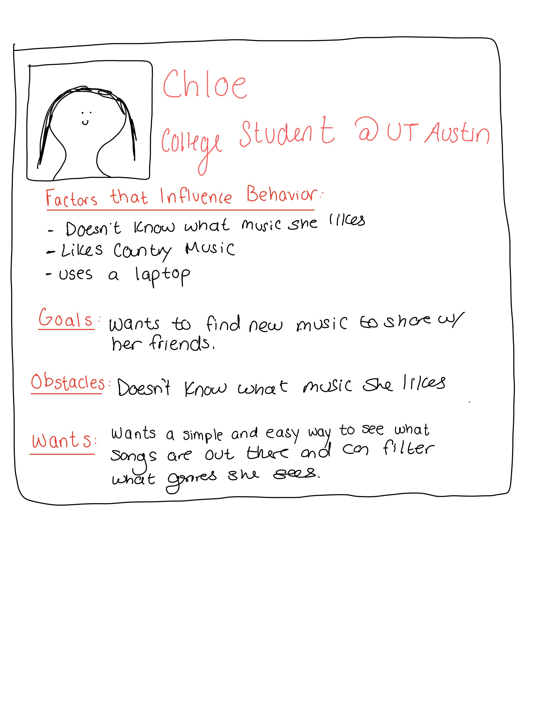

# Project 3, Milestone 1: **Consumer** Design Journey

[← Table of Contents](../design-journey.md)

## _Cohesive_ Audience
> Briefly explain your site's **consumer** audience.
> Your audience should be specific, but not arbitrarily specific.

People that want to find and explore music.

> Be specific and justify why this audience is a **cohesive** group. (1-2 sentences)

This audience is a cohesive group because they all have the same goal of wanting to explore and look through songs.

## Audience Goals
> Document your **consumer** audience's goals.
> List each goal below. There is no specific number of goals required for this, but you need
> enough to do the job (Hint: It's at least 1, but probably no more than 3).

Goal 1: Explore new songs

Goal 2: Be able to filter songs be certain genres.

Goal 2: Be able to look at details for a specific song.

## Persona
> Use the goals you identified to develop a persona of your site's **consumer** audience.
> Your persona must have a name and a face. The face can be a photo of a face or a drawing, etc.
> You may type out the persona below with bullet points or include an image of the persona.
> Just make sure it's easy to read the persona when previewing markdown.

Persona's Name: Chloe

## Contributors

I affirm that I am submitting my work for the consumer requirements in this milestone.

Consumer Lead: Zhalae Daneshvari

[← Table of Contents](../design-journey.md)
