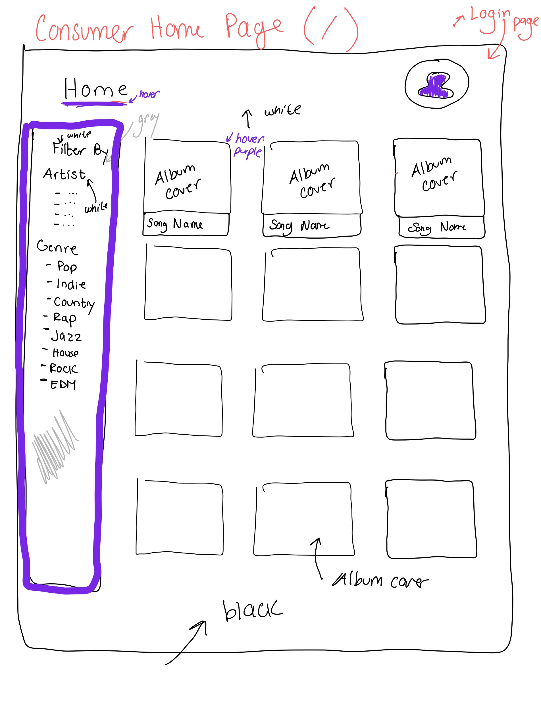
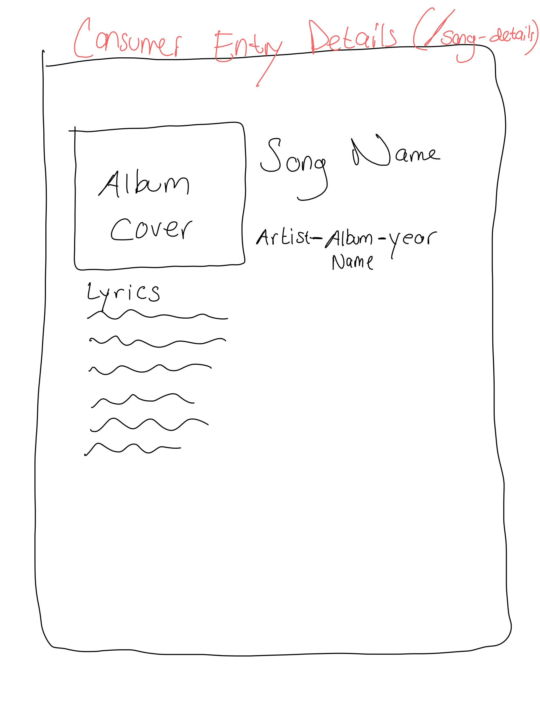
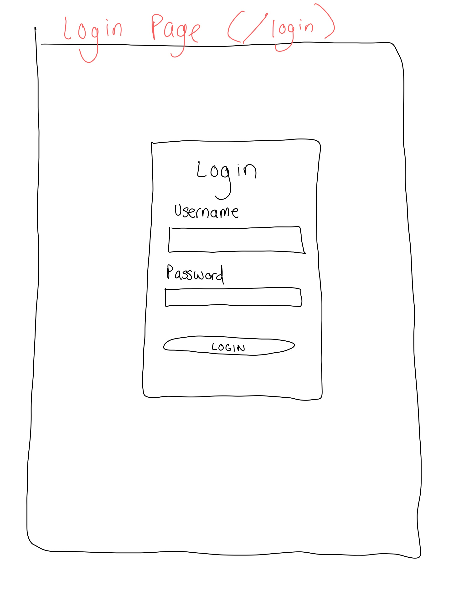
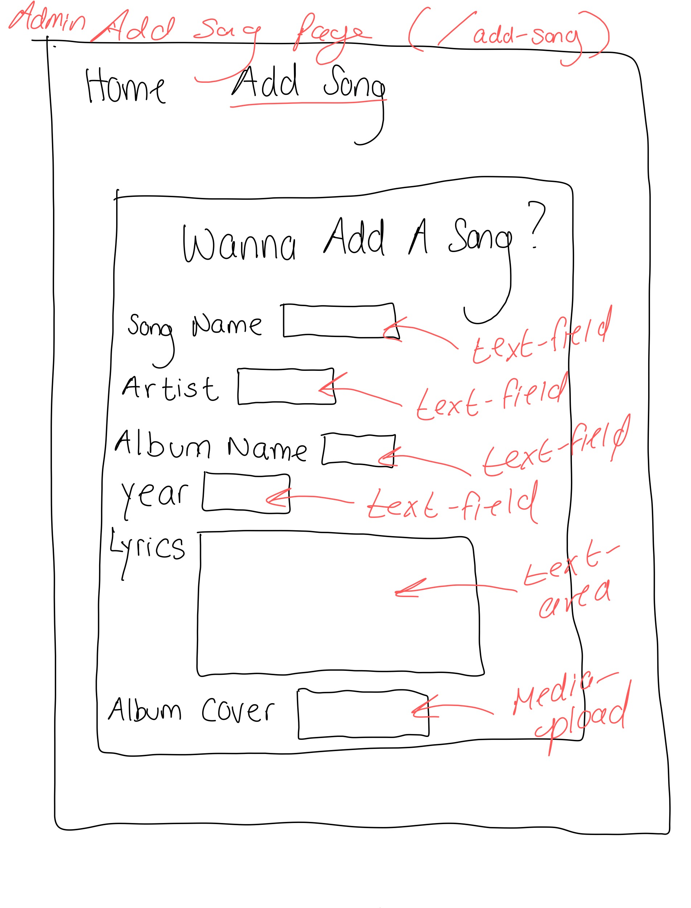
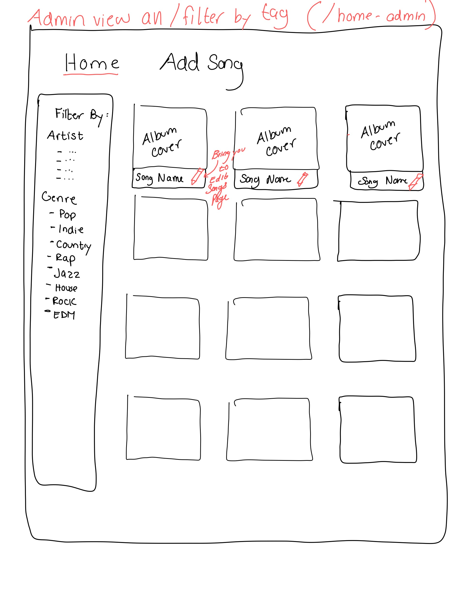
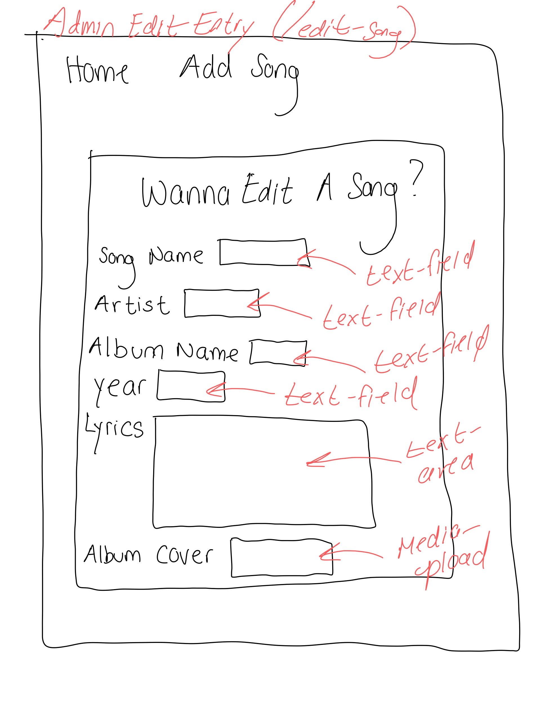

# Project 3, Milestone 1: **Team** Design Journey

[← Table of Contents](design-journey.md)

**Make the case for your decisions using concepts from class, as well as other design principles, theories, examples, and cases from outside of class (includes the design prerequisite for this course).**

You can use bullet points and lists, or full paragraphs, or a combo, whichever is appropriate. The writing should be solid draft quality.

## Catalog
> What will your catalog website be about? (1 sentence)

The catalog will be a music catalog with album covers and filtered by artists, and people can add the songs to their liked songs, similar to Spotify.

## Narrow or Wide Scr
> How will your **consumer** user access this website? From a narrow or wide screen?

Wide screen

## Catalog Design
> Sketch each page of your entire media catalog website
> Provide a brief explanation _underneath_ each sketch. (1 sentence per sketch)
> **Refer to consumer or administrator persona by name in each explanation.**

The consumer home page shows the full catalog of songs, displaying their album cover and song name. The filter bar at the left allows Chloe to filter the songs by specific genres or artists.

This page allows Chloe to see more details about each of the songs when she clicks on them. She can see the Artist name, the album name, the year the song came out, and even the lyrics.

This page allows Alex to login as an admin and be able to then add and edit entries.

This page is very similar to the consumer view all page, but has little pencil icons that indicate to Alex that he can edit each entry.

This page is a form that allows Alex to add new songs to the catalog to keep the site up to date.

This page is a form that allows Alex to edit a specific entry by changing any information that might have been entered incorrectly or has changed over time.

## Catalog Design Patterns
> Explain how your design employs common catalog design patterns. (1-2 sentences)

The design looks very similar to other catalogs in that there is a filter bar on the left side of the screen that allows the user to filter by specific tags (in this case, genre and artist). The media is presented in the form of album covers with the name of the song below the image. This is very similar to the design of Spotify and Apple music and will therefore be familiar to users.

## URL Design
> Plan your HTTP routing.
> List each route and the PHP file for each route.

| Page                                     | Route         | PHP File               |
| ---------------------------------------- | ------------  | ---------------------- |
| home / consumer view all / filter by tag | /             | pages/home.php         |
| consumer entry details                   | /song-details | pages/song-details.php |
| post-login welcome page                  | /welcome      | pages/welcome.php      |
| admin view all / filter by tag           | /home-admin   | pages/home-admin.php   |
| admin insert entry                       | /add-admin     | pages/add-admin.php     |
| Consumer insert entry                    | /add-consumer     | pages/add-consumer.php|
| admin edit entry / tag / untag           | /edit-song    | pages/edit-song.php    |
| login                                    | /login        | pages/login.php        |

> Explain why these routes (URLs) are usable for your persona. (1 sentence)

All of the pages are named very consicely and clearly to match the purpose of the page (ex. /liked-songs shows the user all of the songs they have liked).

## Database Schema
> Plan the structure of your database. You may use words or a picture.
> A bulleted list is probably the simplest way to do this.
> Include constraints for each field.

**Table:** songs

- id: INT {NN, PK, U, AI}
- song_name: TEXT {NN},
- artist: TEXT {NN},
- lyrics: TEXT {NN},
- album_name: TEXT {NN},
<!-- - not sure what type to use for media upload -->
- album_cover: MEDIA {NN}
- year: TEXT {NN}

**Table:** genres

- id: INT {NN, PK, U, AI}
- genre: INT {NN}

**Table:** songGenre

- song_id: INT {NN}
- genre: INT {NN}

## Contributors

I affirm that I have contributed to the team requirements for this milestone.

Consumer Lead: Zhalae Daneshvari

Admin Lead: Sophia Hertel

[← Table of Contents](design-journey.md)
