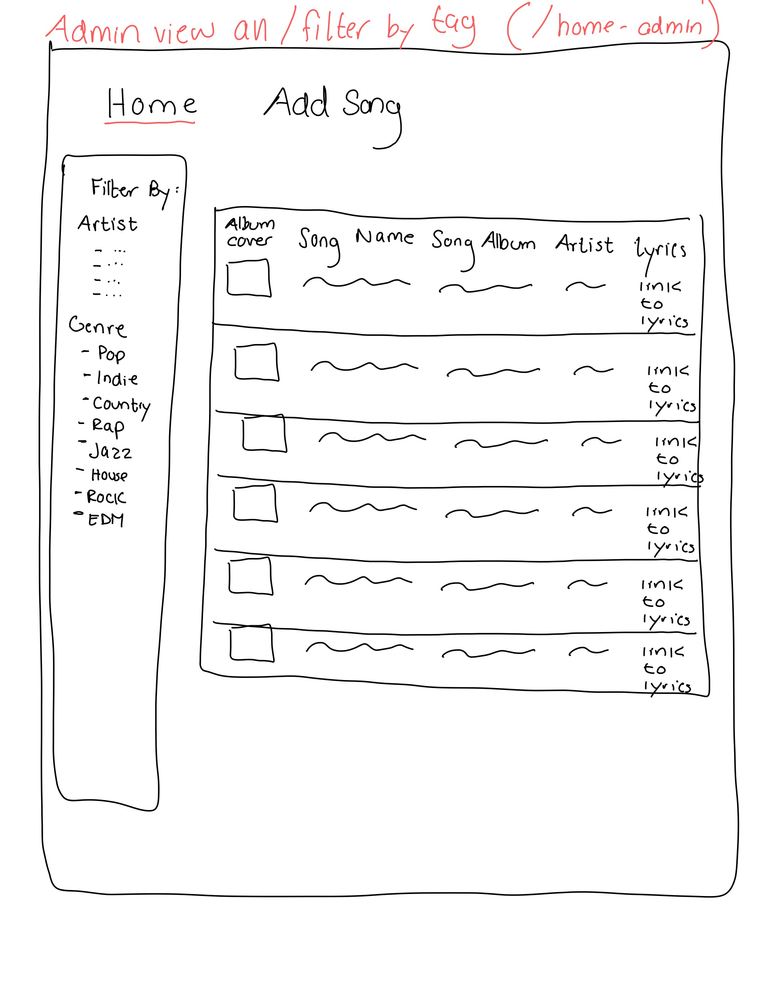

# Project 3, Milestone 2: **Team** Design Journey

[← Table of Contents](design-journey.md)

**Make the case for your decisions using concepts from class, as well as other design principles, theories, examples, and cases from outside of class (includes the design prerequisite for this course).**

You can use bullet points and lists, or full paragraphs, or a combo, whichever is appropriate. The writing should be solid draft quality.

## Milestone 1 Feedback Revisions
> Explain what your team revised in response to the Milestone 1 feedback (1-2 sentences)
> If you didn't make any revisions, explain why.

We revised the admin home page to have a different design because it was too similar to the consumer page. It now follows the common design patterns of a table

## Contributors

I affirm that I have contributed to the team requirements for this milestone.

Consumer Lead: Zhalae Daneshvari

Admin Lead: Sophia Hertel

[← Table of Contents](design-journey.md)
